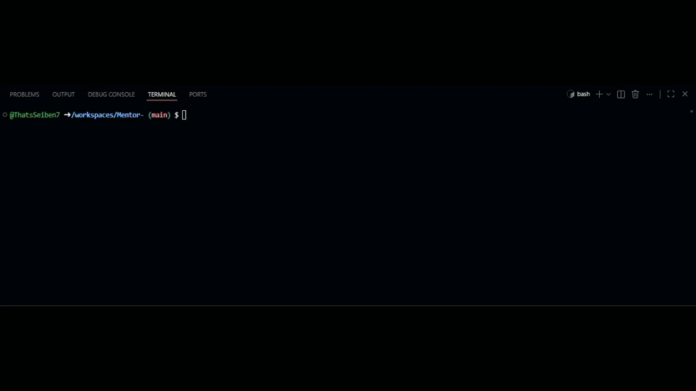

Adaptive Coding Mentor

This is a CLI-based educational coding mentor designed to help developers learn from their mistakes rather than just copying and pasting fixed code.



Taking inspiration from the **NUS-Google AI in Education partnership**, this project implements **Progressive Adaptive Scaffolding** backed by an **Implicit Learner Model**. Instead of standard "code-feeding," Scaffold-AI evaluates your debugging skills over time and tailors its hints to exactly what you need.

Implicit Learner Modelling 
Mentor tracks how much help you need to solve bugs and saves your stats locally (`learner_profile.json`).
* If you consistently fix bugs with minimal hints, you are implicitly promoted to **Advanced**, and future hints become highly subtle and architectural.
* If you frequently need full solutions, the model adjusts to **Beginner** and provides gentler, highly explicit syntax nudges.
* *Privacy First:* All tracking is 100% local.

Progressive Scaffolding 
To respect API quotas (free-tier friendly), Scaffold-AI fetches three distinct tiers of guidance in a **single API call** and reveals them interactively:
* **Tier 1 (Gentle Nudge):** Socratic hint pointing to the logic flaw based on your Learner Model.
* **Tier 2 (Conceptual Breakdown):** Deep explanation of the bug and underlying concepts (zero solution code).
* **Tier 3 (Full Fix & Retrospective):** Complete code fix, explanation, and best practices.
Built with `Rich` for a highly readable, color-coded, interactive terminal experience.

Setup

1. Clone the repository.
2. Install dependencies:
   ```bash
   pip install -r requirements.txt
